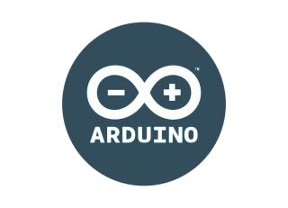

# 𝙷𝚒 𝚝𝚑𝚎𝚛𝚎, 𝙸'𝚖 𝚁𝚒𝚌𝚔𝚢 </strong> 👋  
<!--  -->

## 𝙰𝚋𝚘𝚞𝚝 𝙼𝚎
 - 🧑‍🎓 𝚂𝚝𝚞𝚍𝚢𝚒𝚗𝚐 𝙷𝚘𝚗𝚘𝚞𝚛𝚜 𝙱.𝚂𝚌. 𝙲𝚘𝚖𝚙𝚞𝚝𝚎𝚛 𝚂𝚌𝚒𝚎𝚗𝚌𝚎 𝚊𝚝 York University! (𝟸0𝟸𝟷-𝟸0𝟸𝟻)
 - 🧑‍💻 Currently employed as a Computing Support Assistant at York University!
 - 🚲 A former B𝚒cycle Mechanic for CultureLink BikeHub!

## 𝚆𝚑𝚊𝚝 𝙸'𝚖 𝚞𝚙 𝚝𝚘 
 - 𝙸𝚗 𝚝𝚑𝚎 𝚗𝚎𝚊𝚛 𝚏𝚞𝚝𝚞𝚛𝚎 𝙸 𝚙𝚕𝚊𝚗 𝚝𝚘...
    - 🗣️ 𝙲𝚘𝚗𝚝𝚛𝚒𝚋𝚞𝚝𝚎 𝚊𝚗𝚍 𝚌𝚘𝚕𝚕𝚊𝚋𝚘𝚛𝚊𝚝𝚎 𝚖𝚘𝚛𝚎 𝚘𝚗 𝚝𝚎𝚊𝚖-𝚋𝚊𝚜𝚎𝚍 𝚙𝚛𝚘𝚓𝚎𝚌𝚝𝚜
    - 👀 Create a teaching tool for my professors
    - 🎹 𝙻𝚎𝚊𝚛𝚗 𝚑𝚘𝚠 𝚝𝚘 𝚙𝚕𝚊𝚢 𝚝𝚑𝚎 𝚙𝚒𝚊𝚗𝚘!
    - 👥 Participate in a hackathon
 
 - 𝙾𝚗𝚎 𝚍𝚊𝚢 𝙸 𝚑𝚘𝚙𝚎 𝚝𝚘...
    - 😺 𝙰𝚍𝚘𝚙𝚝 𝚊𝚗𝚘𝚝𝚑𝚎𝚛 𝚌𝚊𝚝!
    - 🤓 𝙶𝚎𝚝 into 𝚊 𝙵𝙰𝙰𝙽𝙶𝙼+ 𝙸𝚗𝚝𝚎𝚛𝚗𝚜𝚑𝚒𝚙
    - 🎮 𝚁𝚎𝚜𝚝𝚘𝚛𝚎 𝚊𝚗 𝚘𝚕𝚍 𝚌𝚘𝚗𝚜𝚘𝚕𝚎 (𝙶𝚊𝚖𝚎 𝙱𝚘𝚢, 𝙶𝚊𝚖𝚎𝙲𝚞𝚋𝚎, 𝚎𝚝𝚌)

## Languages and 𝚃𝚘𝚘𝚕𝚜:

  

 
 
 
 
 

## Contacts:

